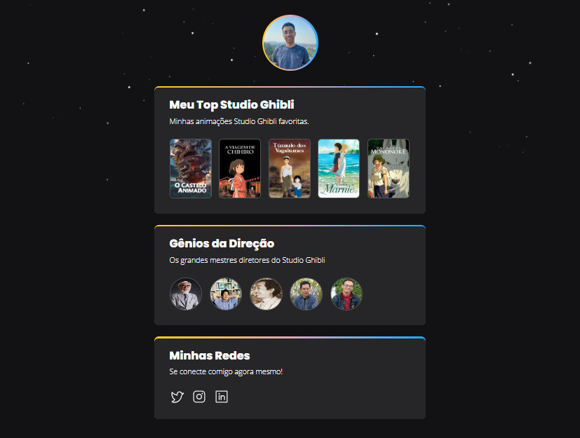

<h1>Meu Hub Studio Ghibli</h1> 

> Status do Projeto: :heavy_check_mark: Concluído
### Tópicos 

:small_blue_diamond: [Descrição do projeto](#descrição-do-projeto)

:small_blue_diamond: [Funcionalidades](#funcionalidades)

:small_blue_diamond: [Deploy da Aplicação](#deploy-da-aplicação)

---

## Descrição do projeto 

  Projeto criado para o desafio da NLW eSports, fazendo alterações e um novo layout. Usei o meu estudio de animação favorito (Studio Ghibli) como tema desse desafio. 
  O desafio me ajudou a praticar meus conhecimentos de HTML, CSS e Git.

## Funcionalidades

:heavy_check_mark: Apresentação de links para ás sinópses das Animações  

:heavy_check_mark: Apresentação de links para ás páginas dos Diretores  

:heavy_check_mark: Apresentação de Links para minhas redes sociais  

## Deploy da Aplicação

> Link do deploy da aplicação. https://maxwellcaue.github.io/hub-studio-ghibl/

## Desenvolvedores/Contribuintes

|[ Maxwell Caue](https://github.com/MaxwellCaue) |
| :---: | 